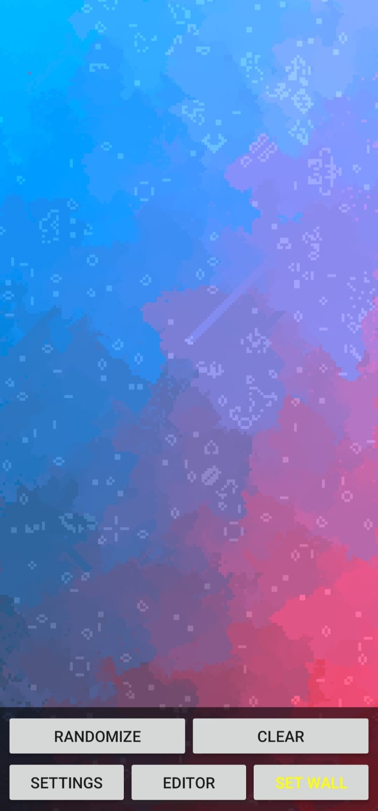
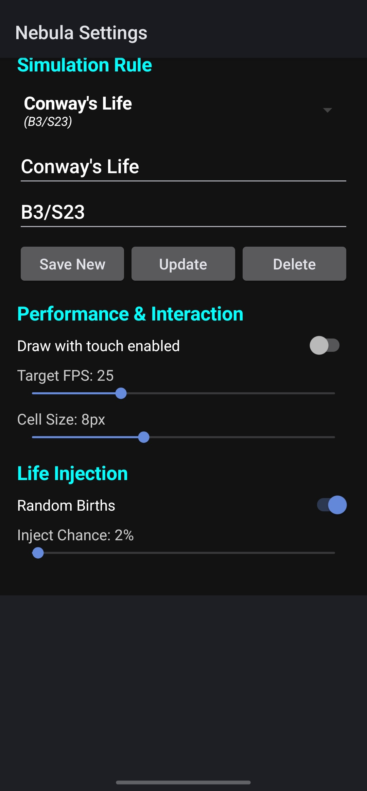
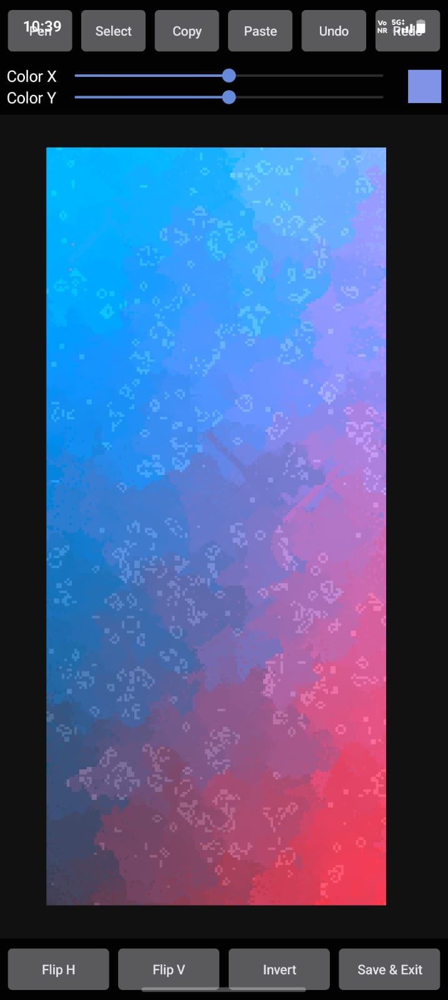

# Nebula Live Wallpaper

This project is a high-performance Live Wallpaper for Android that runs Conway's Game of Life, with the additional effect where every pixels color is determined by the ancestors that helped create the cell or keep it alive.  
_This project was developed with assistance from Gemini._

## Downloads

Download the unsigned APK from [here](https://github.com/ShubhamSinghCodes/NebulaWallpaper/releases). I will probably not get around to generating a signed APK anytime soon.

## Screenshots

 
 
 

## Core Concept & Inspiration

The visual engine of this project is heavily inspired by and based on the work of **KatzenTatzenTanz** on ShaderToy. Specifically, the shader logic is an almost verbatim reproduction of their work, [**"Conways ancestors"**](https://www.shadertoy.com/view/McKXDK).

As explained by the original author, they:

> "Created Conways Game of Life where every pixels color is determined by the ancestors that helped create the cell or keep it alive."

I made this mainly for my own use when I saw the stunning visual effect KatzenTatzenTanz's shader had.

## Features

* **Universal Rule Engine:** Supports all outer totalistic isotropic rules with two states, including the standard B3/S23 (Conway's Life) rule.
* **Ancestor-Based Coloring:** Every cell's color is based on the cells that helped create the cell or keep it alive. Unlike other colourised Life rules where live cells do not change color, here alive cells also change color based on the adjacent cells. I cannot decide if it looks better or worse.
* **High Performance:** Powered by OpenGL ES 3.0, the simulation runs entirely on the GPU. This allows for thousands of cells to be processed simultaneously with minimal impact on the CPU.
* **Battery Efficient:** Optimized for mobile use, the renderer includes adjustable frame rates, including the option to run at the max frame rate possible, and automatically pauses when the screen is off or the device enters Battery Saver mode.
* **Interactive Controls:**
    * **Draw with touch:** Draw directly on the grid to create new life. This is toggleable.
    * **Settings:** Customize ruleset, cell size, frame rate, and "Life Injection".
    * **Named rules:** All rules must be named for changing rules easily. This makes the interface slightly unintuitive to use, but it is the best I could come up with. Comes with a few default rules like Conway's Life, Highlife, Day and Night, etc. You can find more [here](https://conwaylife.com/wiki/List_of_Life-like_rules).
    * **"Life Injection":** Random spontaneous births to keep the simulation from reaching a static state. Idea taken from KatzenTatzenTanz's shader. For some reason, it only works when the Inject Chance is kept above 2%, probably due to the range of the hash function used.
    * **Editor:** Edit the grid with the usual draw, select, copy and paste (In RLE format, allowing you to import and export patterns via the clipboard), flip vertically and horizontally, and invert state options.

## Credits

Special thanks to **KatzenTatzenTanz** for the brilliant shader logic provided via [ShaderToy](https://www.shadertoy.com/view/McKXDK). This project serves as a mobile-optimized implementation of their mathematical art.  
All the code was written by Gemini.
